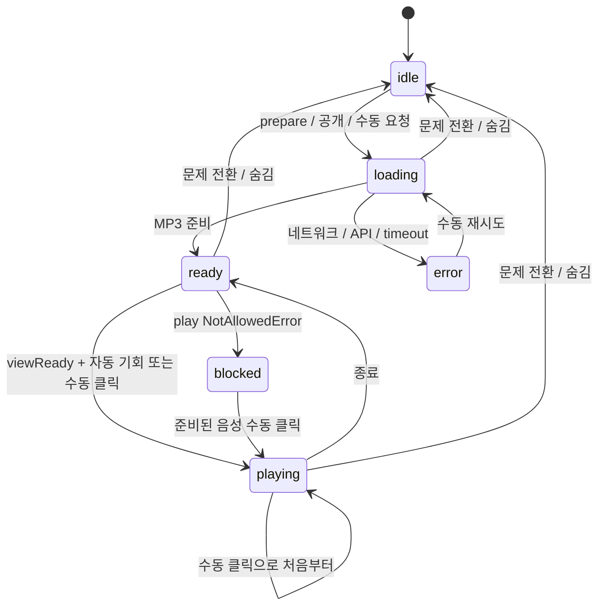

# 중국어 표제어 음성 재생 아키텍처

> 작성일: 2026-09-14 · 개정일: 2026-09-15 · 브랜치: `feat/ch-sound` · 분석 기준 커밋: `10dc04c`.
>
> 상태: **병합된 구현 계약 및 출시 전 운영 기준**. 기능 구현과 #150 자동 회귀는 `feat/ch-sound`에 병합됐다. 유료 합성·청취 테스트·실제 배포 활성화는 수행하지 않았다. 2026-09-15 소유자가 QwenCloud / `qwen-audio-3.0-tts-flash`를 확정했고 API 키 발급 사실만 확인했다. 음색·속도는 구현 기본값이며 실제 secret 주입·연결은 미검증이다.
>
> 2026-09-14 개정: 소유자의 저장 방식 채택을 반영해 **첫 요청 시 생성 + 비공개 R2 지속 저장**으로 변경했다. 원안의 Cache API 단독 보관안을 대체하며, 등록 직후 선생성은 후속 단계로 둔다.
>
> 제품 동작·완료 조건: [중국어 TTS PRD](../PRD-chinese-tts-audio.md). 운영 순서: [중국어 TTS 운영 런북](../plans/chinese-tts-audio-operations.md). 환경 사실: [#149 환경 기록](../plans/chinese-tts-audio-environment.md). 자동 증거: [#150 검증 기록](../plans/chinese-tts-audio-verification.md). 구현 단위: [이슈 17개와 의존성 그래프](../plans/chinese-tts-audio-tasks.md). 논의 원문: [중국어 발음 읽어주기 결정 내역](https://github.com/damdam6/vocabulary-study/blob/claude/chinese-word-audio-reading-5dva2m/docs/plans/chinese-tts-audio.md).

## 1. 구조와 핵심 결정

기존 React SPA와 Cloudflare Worker에 음성 요청·재생 경로와 비공개 R2 버킷을 추가한다. Worker가 기존 인증으로 `zh` 프로필을 확인한 뒤 저장된 음성을 먼저 조회한다. 파일이 없을 때만 외부 TTS를 호출해 생성한 MP3를 저장하고 재생한다. Google Sheets는 단어의 원천으로 유지되며 TTS 요청에서 조회하거나 수정하지 않는다.

```mermaid
flowchart LR
  Cards["Mode1Card / Mode2Card"] --> Player["세션 Audio controller"]
  Player --> Memory["세션 Blob 캐시"]
  Player --> Transport["ttsApi → apiFetch"]
  Transport --> Route["POST /api/tts"]
  Route --> Auth["기존 인증 → zh 확인"]
  Auth --> Validate["입력·설정 검증 / 병음 처리"]
  Validate --> Service["service / 조회·합성·저장 정책"]
  Service --> Lookup["프로필·내용·설정으로 객체 조회"]
  Lookup --> R2[("비공개 R2 / MP3 보관")]
  R2 -- "저장된 MP3" --> Response["인증된 응답 / MP3 bytes"]
  Lookup -- "파일 없음 확인" --> Adapter["선택된 TTS adapter"]
  Adapter --> Provider["Qwen-Audio-3.0-TTS-Flash / WebSocket"]
  Provider --> Save["MP3 검증 → R2 조건부 저장"]
  Save --> R2
  Save --> Response
  Response --> Transport
```



| 결정 | 내용 | 이유 |
|---|---|---|
| 요청 | `POST /api/tts { text, pinyin? }` | 원안 유지, 문장도 같은 계약 |
| 제공자 경계 | Worker 내부 인터페이스, 최초에는 Qwen adapter만 구현 | UI·인증·저장소와 벤더 계약 분리 |
| 출력 | 완성된 MP3, `audio/mpeg` | 짧은 입력·수동 재생·Blob 캐시를 단순화 |
| 재생 소유 | StudyScreen 수명의 controller 1개 / HTMLAudioElement 1개 | 이전 문제 소리와 늦은 응답 통제 |
| 보관 | R2 Standard에 MP3 지속 저장 + 세션 Blob 캐시 | 세션·지역이 바뀌어도 같은 파일 재사용 |
| 생성 시점 | 첫 음성 요청 시 생성. 등록 직후 선생성은 후속 | 기존 단어·시트 직접 편집에도 같은 경로 적용 |
| 파일 접근 | R2 비공개, Worker 응답은 `private, no-store` | 저장 파일도 매 요청 인증을 거쳐 전달 |
| 발음 힌트 | 첫 버전은 원문 합성, 병음은 표시·저장 키에만 사용 | 기본 음색의 병음 강제 지원이 확인되지 않음 |
| 실패 | 음성만 실패. 합성 자동 재시도·벤더 자동 전환 없음 | 중복 과금·다른 발음으로의 조용한 변경 방지 |
| 운영 | 음성 설정을 프로필 설정과 독립적으로 검증 | TTS 키 누락이 로그인·학습을 막지 않음 |

### 1.1 현재 코드에서 확인한 통합 지점

| 현재 파일 | 확인한 구조 | 설계에 미치는 영향 |
|---|---|---|
| [worker/index.ts](../../worker/index.ts) | `/api/*` 안에서 `resolveProfile` 후 라우팅 | TTS도 이 인증 블록 안에 추가 |
| [src/lib/api.ts](../../src/lib/api.ts) | `apiFetch`가 Bearer·401·성공 콜백 담당 | TTS 전송도 반드시 재사용 |
| [src/screens/StudyScreen.tsx](../../src/screens/StudyScreen.tsx) | `key={session.pos}`로 카드 리마운트, 모드2 오답만 머무름 | 질문 식별은 세션 ID + pos, 카드 밖에서 player 소유 |
| [src/screens/Mode1Card.tsx](../../src/screens/Mode1Card.tsx) | 앞·뒷면 모두 하나의 `<button>` 안에 있음 | 비대화형 플립 컨테이너와 앞면·뒷면 버튼을 분리 |
| [src/screens/Mode2Card.tsx](../../src/screens/Mode2Card.tsx) | `wrongAnswer !== null`이면 결과 화면 | 빈 문자열 오답도 공개 사건으로 처리 |
| [src/main.tsx](../../src/main.tsx) | React StrictMode 활성 | effect 재실행·정리에도 자동재생 유실/중복 방지 |
| [src/lib/pinyinValidation.ts](../../src/lib/pinyinValidation.ts) | `pinyin-pro` 문자별 후보 조합으로 일치 여부만 반환 | 기존 등록 검증으로 유지. 첫 버전 TTS에서 재사용하지 않음 |
| [worker/lib/register.ts](../../worker/lib/register.ts) | `HANZI_RE = /^[一-鿿]+$/u`, 병음 필수 | TTS 문장 지원과 등록 계약 확장을 구분 |
| [src/test-utils.tsx](../../src/test-utils.tsx) | React `act`·jsdom 렌더 헬퍼 | 신규 UI 테스트도 같은 도구 사용 |

## 2. 제공자 선택과 어댑터

### 2.1 선택 결과와 구현 기본값

**QwenCloud / `qwen-audio-3.0-tts-flash` 확정, API 키 발급 사실 확인**이다. `qwen3-tts-flash`의 HTTP URL/WAV API를 이 모델의 계약으로 사용하지 않는다. 선택 모델은 국제 DashScope WebSocket으로 MP3를 받을 수 있다. [선택 모델의 공식 API 예시·요금](https://www.qwencloud.com/models/qwen-audio-3.0-tts-flash)

기본 음색 `longanfengyue`는 해당 모델의 표준 중국어 시스템 음색이다. 속도 1.0, MP3 24kHz·128kbps, volume 50, pitch 1.0, seed 0, `language_hints: ["zh"]`를 구현 기본값으로 둔다. SSML은 끄고 instruction·hot_fix·복제 음성은 사용하지 않는다. 음색·출력 설정은 실제 청취와 모델 접근 검증 전의 기본값이다. [음색 목록](https://docs.qwencloud.com/developer-guides/speech/voice-list/qwen-audio-tts), [오디오 설정](https://docs.qwencloud.com/api-reference/speech-synthesis/cosyvoice/python-sdk)

`hot_fix`는 선택 모델에서 미지원이다. SSML 병음 지정은 지원 음색 조건이 있으며 `longanfengyue`의 지원이 확인되지 않았다. 첫 버전은 병음 미적용 정책을 명시하고 §5를 따른다. 무료 제공량·계정 상태는 [PRD §5.3](../PRD-chinese-tts-audio.md#53-제공자-확정과-이용-조건)에 기록한다.

### 2.2 인터페이스

```ts
interface SynthesisInput {
  text: string; // 정규화한 A열. 병음을 합성 payload에 섞지 않음
}

type PronunciationDecision =
  | { status: "absent"; effectiveHint: null }
  | {
      status: "ignored";
      reason: "provider_hint_unsupported";
      effectiveHint: null;
    };

interface TtsProvider {
  readonly pronunciationMode: "none";
  synthesize(
    input: SynthesisInput,
    signal: AbortSignal,
  ): Promise<{
    audio: Uint8Array;
    contentType: "audio/mpeg";
    billedCharacters?: number;
  }>;
}
```

provider에는 검증한 설정과 시크릿을 주입한다. 라우트는 검증된 원문·병음을 서비스에 넘기고 서비스는 병음을 저장 키에 보존하며 공통 병음 정책으로 진단 상태를 정한다. provider로는 `text`만 전달한다. 후속 제공자 교체는 adapter와 설정 검증으로 격리하되 힌트 지원 추가 시 타입·정책·revision도 함께 개정한다. 사용하지 않는 병음 분해기나 가상의 지원 adapter는 구현하지 않는다.

라우트는 인증·본문 검증·HTTP 응답을, 서비스는 R2 조회·합성·저장 조합과 단계별 deadline을 소유한다. adapter는 주입된 AbortSignal로 연결을 관리하고 순수 프로토콜 모듈에 이벤트·오디오 처리를 맡긴다. 외부 SDK 없이 Workers `fetch`의 Upgrade 응답과 `WebSocket`을 사용한다.

### 2.3 Qwen WebSocket 요청과 완료 조건

고정 제공자 주소는 `wss://dashscope-intl.aliyuncs.com/api-ws/v1/inference`다. Workers에서는 같은 호스트·경로의 `https://` 주소로 `Upgrade: websocket`, `Authorization: Bearer <DASHSCOPE_API_KEY>`를 보내고 101 및 `response.webSocket`을 확인한다. 리디렉션은 따라가지 않는다. 리스너 등록·`accept()` 후 task를 시작한다. 연결은 R2 miss 한 건에 하나이며 재사용 풀은 만들지 않는다. [Workers 외부 WebSocket 연결](https://developers.cloudflare.com/workers/examples/websockets/)

1. 새 UUID를 만들고 `run-task`를 전송한다. header는 `action / task_id / streaming: "duplex"`, payload는 `task_group: "audio"`, `task: "tts"`, `function: "SpeechSynthesizer"`, 모델·parameters·빈 input으로 구성한다.
2. parameters는 `text_type: "PlainText"`, `voice: "longanfengyue"`, `format: "mp3"`, `sample_rate: 24000`, `bit_rate: 128`, `rate: 1.0`, `volume: 50`, `pitch: 1.0`, `seed: 0`, `language_hints: ["zh"]`, `enable_ssml: false`다. rate·voice는 검증한 서버 설정에서만 바꾼다.
3. 같은 task ID의 `task-started`를 받은 뒤 `continue-task`의 `payload.input.text`에 원문 전체를 한 번 전송하고, 이어 `finish-task`와 빈 input을 전송한다.
4. 바이너리 메시지만 수신 순서대로 모아 최종 MP3를 만든다. JSON 이벤트는 오디오에 섞지 않는다. 같은 ID의 `task-finished`까지 받아야 합성 성공이다. 응답에 유효한 `payload.usage.characters`가 있으면 실제 과금 문자로 반환하며 없으면 추정값을 채우지 않는다.

요청 필드는 [client events](https://docs.qwencloud.com/api-reference/speech-synthesis/cosyvoice/client-events), 완료·실패 이벤트는 [server events](https://docs.qwencloud.com/api-reference/speech-synthesis/cosyvoice/server-events)를 따른다. 브라우저에는 기존 HTTP `POST /api/tts`로 완성 MP3만 반환한다. 사용자 기기에서 Qwen으로 WebSocket을 열거나 키를 전달하지 않는다.

### 2.4 검증·실패·연결 정리

아래 제한은 앱의 구현 계약이다. 바이너리 합계 4MiB, JSON 이벤트 하나 64KiB·합계 1MiB로 제한한다. 큰 메시지를 누적 복사하기 전에 크기를 확인하며, 첫 바이트만 검사하지 않고 완성 바이트의 MP3 구조와 비어 있지 않은 오디오를 검증한다. `task-finished` 전 종료·`task-failed`·잘못된 JSON·예상 밖 이벤트 순서·다른 task ID·크기 초과는 성공으로 저장하지 않는다. 명세의 정상 `result-generated` 메타데이터는 상한 안에서 무시한다.

handshake 401/403/429와 task의 인증·권한·할당량/요청 제한 오류는 `503 tts_unavailable`, upstream 5xx·protocol/형식 오류는 `502 tts_upstream_error`로 정규화한다. task 오류는 문서화된 error_code를 allowlist로 분류하고 알 수 없는 값은 502로 처리하며 원문 에러 메시지로 추측하지 않는다. deadline은 연결·task-started 대기·오디오 전체 수신·완료 이벤트까지 합계 12초이고 초과 시 504다.

성공·실패·취소 모두 Promise를 한 번만 종료한다. listener·timer·abort handler를 정리하고 socket을 닫으며 부분 오디오는 버린다. handshake가 취소 뒤 늦게 완료되어도 그 socket을 닫는다. 신호가 이미 취소됐으면 연결하지 않는다. 열려 있는 task 취소는 가능한 경우 `finish-task`의 `input.directive: "cancel"`을 best effort로 보내고 종료하되 응답을 기다리며 deadline을 늘리지 않는다. 취소가 과금 취소를 보장하지는 않는다.

A열은 JSON 문자열로 직렬화한다. SSML·instruction·발음 사전·다른 모델 endpoint를 자동 대체하거나 재시도하지 않는다. 키·원문·병음·제공자 원문 이벤트는 응답과 로그에 남기지 않는다.

### 2.5 분할 구현의 모듈 경계

| 모듈 | 책임 / 외부 의존 |
|---|---|
| `types.ts / config.ts / input.ts / pronunciation.ts` | TTS-01 공통 계약·검증·미적용 정책 |
| `audio.ts / providers/qwenProtocol.ts` | TTS-03 MP3 검사·메시지 직렬화·이벤트 순서·바이트 조립. 네트워크·timer 없음 |
| `providers/qwen.ts` | TTS-04 Upgrade·전송·수신·abort·socket 정리. 03 사용 |
| `storage.ts` | TTS-02 R2와 validateAudio 주입. 키·조회·조건부 put, 원래 Promise 노출 |
| `service.ts` | TTS-05 검증된 입력·설정과 저장소/provider/clock/작업 등록 함수를 받음. 2/12/2초 예산·경합·결과 결정 |
| `routes/tts.ts / index.ts / routes/words.ts` | TTS-06 인증·HTTP·capability·ctx 연결. 서비스 정책 중복 없음 |

서비스가 `audio.ts`의 실제 검사기를 저장소에 주입한다. R2 이슈는 검사 더블로 먼저 완성할 수 있어 Qwen 프로토콜 이슈를 기다리지 않는다. MP3 파서를 저장소·제공자마다 따로 만들지 않는다.

서비스는 HTTP 객체 대신 검증된 프로필·정규화 입력·설정·signal을 받고, 바이트·source/storage·발음 진단 결과를 반환한다. 백그라운드 작업 등록 포트는 `(promise: Promise<unknown>) => void`이고 라우트에서 `ctx.waitUntil`에 연결한다. 서비스는 원래 put의 늦은 성공·실패를 처리한 Promise를 등록한다. 12초 합성 timer는 서비스 한 곳에서 만들고 adapter는 해당 signal에 반응한다.

## 3. API 계약

### 3.1 `POST /api/tts`

```http
POST /api/tts
Authorization: Bearer <기존 앱 비밀번호>
Content-Type: application/json

{"text":"经济","pinyin":"jīngjì"}
```

인증된 `profile.contentType === "zh"`에서만 허용한다. client가 보낸 `profileId`, `contentType`, provider·음색·속도·URL·SSML 필드는 받아들이지 않는다. 등록된 단어인지 Sheets를 다시 조회하지 않으므로 이 API는 **인증된 zh 프로필에 대한 제한 길이 합성 API**다. “정답 공개 뒤 요청”은 UI 정책이며 서버가 시험 상태를 증명하는 보안 경계는 아니다.

| 필드·조건 | 검증 |
|---|---|
| 본문 | JSON 객체만, 배열·null·알 수 없는 필드 거부 |
| 본문 바이트 | 최대 16KiB. `Content-Length`만 믿지 않고 스트림을 제한하며 읽음 |
| `text` | 필수 문자열. NFC + 앞뒤 trim 후 1~200 Unicode 코드 포인트 |
| 텍스트 구성 | 한자 1개 이상. 문장부호·숫자·라틴문자·공백 혼합 허용 |
| 공백·제어문자 | CRLF/CR→LF. 탭·LF 허용, NUL 등 그 외 C0 제어문자 거부 |
| `pinyin` | 생략 또는 문자열. NFC·trim 후 빈 문자열은 생략과 동일. 최대 1,000 코드 포인트 |
| 병음 의미 | 첫 버전은 의미 검증·음절 분해를 하지 않고 값이 있으면 항상 미적용 |

한자 판정은 Unicode Han script 기준으로 한다. 등록 화면의 기본 블록 전용 정규식을 TTS에 재사용하지 않는다. 길이는 `Array.from(text).length`로 계산하며 JS UTF-16 `text.length`나 시각적 글자 수와 혼동하지 않는다. 병음 미적용 정책은 §5를 따른다.

성공 응답:

```http
HTTP/1.1 200 OK
Content-Type: audio/mpeg
Cache-Control: private, no-store
X-Content-Type-Options: nosniff
X-TTS-Source: STORED
X-TTS-Storage: PRESENT
X-TTS-Pronunciation: ignored
X-TTS-Revision: tts-v1

<MP3 bytes>
```

`X-TTS-Source`는 반환 바이트의 출처인 `STORED | GENERATED`다. `X-TTS-Storage`는 `PRESENT`(R2에서 조회), `SAVED`(이번 요청의 저장 성공), `UNCONFIRMED`(생성했으나 저장 실패·대기 초과 또는 저장 경합 결과 확인 실패)다. 응답 조합은 `STORED/PRESENT`, `GENERATED/SAVED`, `GENERATED/UNCONFIRMED`다. 이번 구현의 발음 상태는 `absent | ignored`다. `applied`는 반환하지 않는다. 저장 객체의 과거 진단 헤더를 복사하지 않고 이번 요청 기준으로 작성한다.

최종 MP3 최대 4MiB, 제공자 JSON 이벤트 하나 64KiB·전체 1MiB로 제한한다. R2에서 읽은 데이터에도 MIME·크기·오디오 형식 검증을 적용한다. MP3가 아닌 HTML·JSON 에러를 `audio/mpeg`라고 붙여 반환하지 않는다.

### 3.2 실패 응답

TTS 라우트 오류는 `{ "error": "tts_unavailable", "message": "발음을 불러올 수 없습니다." }`와 같이 안정적인 코드·한국어 안내를 반환한다. 실제 제공자 메시지·키·SSML·본문은 반환하지 않는다. 모든 응답은 `Cache-Control: private, no-store`다.

| 상태 | 코드 / 조건 | 클라이언트 처리 |
|---|---|---|
| 400 | `invalid_tts_request`: JSON·필드·길이·텍스트 조건 위반 | 자동 실패는 조용히, 수동은 안내 |
| 401 | 기존 앱 인증 실패. 기존 빈 본문 계약 유지 | `apiFetch`의 로그인 복귀 |
| 403 | `tts_not_allowed`: generic 프로필 | 재생 안 함 |
| 405 | `method_not_allowed`: TTS 경로의 POST 외 메서드, `Allow: POST` | 재시도 없음 |
| 413 | `tts_request_too_large`: 16KiB 초과 | 재시도 없음 |
| 415 | `unsupported_media_type`: JSON 이외 | 재시도 없음 |
| 503 | `tts_disabled`, `tts_not_configured` | 현재 세션의 TTS 기능을 비활성화 |
| 503 | `tts_unavailable`: 제공자 인증/할당량/429 | 수동 재시도 가능 |
| 503 | `tts_storage_unavailable`: R2 조회 예외·2초 초과·저장 객체 검증 실패 | 수동 재시도 가능, 외부 합성은 시작하지 않음 |
| 502 | `tts_upstream_error`: 제공자 5xx·잘못된 응답·미지원 음성 데이터 | 수동 재시도 가능 |
| 504 | `tts_timeout`: 합성 12초 초과 | 수동 재시도 가능 |
| 500 | 기존 `PROFILES` 구성 오류 또는 예상 못 한 내부 오류 | PROFILES 오류는 기존 JSON 계약을 유지하고, 라우트 내부 오류는 `tts_unavailable`의 고정 한국어 본문만 반환 |

제공자의 `401/403`은 앱의 `401/403`과 구분해 `503 tts_unavailable`로 변환한다. 유효한 앱 비밀번호를 지우는 일이 없어야 한다. R2 조회 오류를 파일 없음으로 처리하지 않는다. 합성 성공 뒤 R2 쓰기만 실패하면 `200 GENERATED/UNCONFIRMED`로 음성을 반환한다. `UNCONFIRMED`는 UI 오류로 표시하지 않고 운영 진단에서만 사용한다.

### 3.3 기능 활성 정보: `GET /api/words`의 선택 필드

기존 `{ profile, words, settings }`에 다음 최상위 필드를 추가한다. 프로필 스키마·`PROFILES`·`/api/health` 계약은 바꾸지 않는다.

```ts
type TtsCapability =
  | { enabled: false }
  | { enabled: true; revision: string; maxTextLength: 200 };
// words 응답: { profile, words, settings, tts?: TtsCapability }
```

`zh`이며 기능 flag·R2 바인딩·필수 합성 설정이 유효할 때만 `enabled: true`. 이것은 **설정상 사용 가능**이라는 의미이며 제공자·R2 실시간 가용성 검사는 아니다. 미설정·잘못된 TTS 설정·generic은 false를 반환하고 words 조회는 정상 완료한다. 저장 파일 조회에는 제공자 네트워크 호출이 없으므로 설정이 유효한 상태의 제공자 장애는 저장 파일 재생을 막지 않는다.

구 서버 응답처럼 필드가 없거나 형식이 잘못되면 클라이언트는 false로 처리한다. HomeScreen이 응답에서 받은 profile과 tts를 세션 시작 시 App에 함께 전달하고 StudyScreen은 그 스냅샷을 받는다. 별도 localStorage 키나 프로필 저장 형식 변경은 필요 없다.

## 4. Worker 요청 수명주기

1~2는 라우트, 3~7은 서비스의 책임이다. 저장소·provider는 개별 작업만 수행하며 서비스의 조합 정책을 중복 구현하지 않는다.

1. `index.ts`의 기존 `resolveProfile`을 통과한다. TTS 경로의 메서드·zh·기능 설정을 확인한다.
2. 본문 바이트 제한→JSON 파싱→필드 검증→정규화를 수행한다.
3. 병음 미적용 진단과 원문만의 `SynthesisInput`을 만들고 정규화한 입력·합성 설정·프로필을 포함한 R2 객체 키를 계산한다.
4. `env.TTS_AUDIO.get(key)`를 호출한다. 파일이 있으면 바이트를 검증하고 `STORED/PRESENT`로 반환한다. 메타데이터·바디 읽기 포함 최대 2초다. 예외·초과·손상 파일이면 `503 tts_storage_unavailable`로 끝낸다.
5. `get`이 정상적으로 `null`을 반환한 경우에만 선택 adapter를 한 번 호출한다. 합성 12초 제한은 WebSocket handshake부터 마지막 오디오·task-finished까지 포함한다.
6. 오디오 형식·크기를 검증한 뒤 같은 키가 없을 때만 쓰는 조건부 R2 put을 시작한다. 저장·경합 결과 확인에는 합계 최대 2초를 쓴다.
7. 저장 성공이면 `GENERATED/SAVED`. 다른 요청이 먼저 저장했다면 남은 저장 단계 시간 안에서 그 파일을 다시 읽어 `STORED/PRESENT`로 반환한다. put 실패·시간 초과·경합 후 재조회 실패이면 지금 생성한 바이트를 `GENERATED/UNCONFIRMED`로 반환한다.

클라이언트 준비 제한은 20초로 두어 조회 2초·합성 12초·저장 단계 2초와 전송 여유를 포함한다. 합성 실패 시에는 저장하지 않는다. 저장 단계를 무한히 기다리거나 저장 실패 때문에 다시 합성하지 않는다.

`index.ts`의 fetch에 `ctx`를 추가하고 필요한 라우트에 전달한다. TTS의 모든 HTTP 응답(기존 빈 401·PROFILES 500 포함)은 `private, no-store`이며, 성공 전용 `X-TTS-*` 헤더는 오류에 붙이지 않는다. 기존 테스트에서 직접 `worker.fetch(request, env)`를 호출하던 곳은 실행 컨텍스트 테스트 더블을 받도록 갱신한다.

브라우저 취소 신호가 Worker에서 관측되면 handshake fetch를 취소하고 열린 제공자 socket을 종료한다. 다만 연결 종료가 반드시 외부 합성을 취소하거나 과금을 취소하는 것은 아니다. 이미 MP3 생성·검증이 끝났다면 시작한 R2 저장은 `ctx.waitUntil`로 완료를 시도한다. R2 작업의 대기 제한은 해당 작업을 실제 취소한다는 의미가 아니므로 늦은 완료·실패도 관측하고 처리한다. 늦은 소리 방지는 클라이언트의 질문 토큰 검증으로 보장한다.

전역 Promise 맵으로 요청 사이의 실행 컨텍스트를 공유하는 중복 합성 병합은 이번 버전에 도입하지 않는다. 클라이언트 내 중복 요청은 합치되, 서로 다른 탭·isolate·지역의 동시 최초 요청은 중복 합성할 수 있음을 비용 모델에 반영한다. 조건부 저장은 기존 파일 덮어쓰기만 방지하며 합성 호출을 전역 1회로 보장하지 않는다.

## 5. 병음 힌트 처리

### 5.1 첫 버전의 명시적인 미적용 정책

B열은 NFC·trim 정규화 후 저장 키에 넣는다. 생략·빈칸이면 `absent`, 값이 있으면 `ignored`와 `provider_hint_unsupported`로 기록한다. `effectiveHint`는 항상 null이며 합성 입력은 A열 원문뿐이다. 병음 의미를 검사하거나 새 발음을 추정하지 않는다. 입력 타입·길이 검증은 §3.1을 유지한다.

```text
经济 + jīngjì → ignored, 합성 text = 经济
行 + xíng    → ignored, 합성 text = 行
行 + háng    → ignored, 합성 text = 行 (저장 키는 위와 다름)
你好，世界！ + 빈 병음 → absent, 원문 합성
```

B열 표시·기존 등록 검증은 유지한다. 병음을 원문에 붙여 읽거나 instruction에 넣고 강제 적용으로 보고하지 않는다. 고립된 다음자는 원하는 성조가 보장되지 않는다는 한계를 PRD·청취 기록에 남긴다.

### 5.2 후속 확장의 경계

선택 모델은 `hot_fix`를 지원하지 않으며, SSML의 `phoneme`은 복제 음성 또는 지원 표시가 있는 시스템 음색에서 사용할 수 있다. 현재 기본 음색에는 이 지원을 가정하지 않는다. [발음 교정 제약](https://docs.qwencloud.com/api-reference/speech-synthesis/cosyvoice/client-events), [SSML 조건·phoneme](https://docs.qwencloud.com/developer-guides/speech/ssml)

지원 음색·실제 발음을 검증한 후 별도 변경에서 병음 음절 분해, 숫자 성조, 경성·ü 처리, 모호한 대응 처리, SSML escaping을 함께 설계한다. 그때 `PronunciationDecision`의 applied 상태와 provider 타입을 확장하고 정책 버전·revision을 증가시킨다. 미적용 정책은 TTS-01의 공통 입력 처리에 포함한다. 미래 알고리즘을 별도 구현 이슈로 남겨두지 않는다.

## 6. 음성 저장과 세션 캐시

### 6.1 비공개 R2 음성 저장소

Worker에 `TTS_AUDIO: R2Bucket` 바인딩 1개를 추가한다. R2 Standard를 사용하며 운영·검증 버킷은 분리한다. 공개 `r2.dev` 접근과 공개 도메인을 설정하지 않는다. 읽기·쓰기는 기존 인증을 거친 Worker 라우트에서 바인딩으로 수행하며, 브라우저에 R2 키나 직접 다운로드 URL을 전달하지 않는다. 첫 버전에는 Worker Cache API·KV·D1을 추가하지 않는다. [R2 Worker 바인딩](https://developers.cloudflare.com/r2/api/workers/workers-api-reference/)

객체 경로는 `audio/v1/{profilePartition}/{revision}/{digest}.mp3`다. `profilePartition`은 서버 프로필의 `[id, sheetId]`를 SHA-256으로 해시한 값이다. revision은 서버가 검증한 영문·숫자·하이픈·밑줄 1~64자로 제한한다. `digest`는 아래 튜플을 안정적으로 JSON 직렬화한 뒤 SHA-256으로 계산한다. 문자열을 구분자 없이 이어 붙이지 않는다.

```ts
[
  "tts-audio-v1",
  profile.id, profile.sheetId,       // 인증된 서버 프로필 값
  config.revision,
  config.provider, config.region, config.model, config.voice,
  "zh-CN", config.rate, config.outputFormat,
  config.audioSettings,             // sampleRate·bitRate·volume·pitch·seed·SSML 등
  config.adapterVersion, "pinyin-none-v1",
  normalizedText,
  normalizedPinyin || null,
  null,                            // 첫 버전의 effectiveHint
]
```

비밀번호·API 키는 해시 입력에도 넣지 않는다. 다른 탭의 같은 내용은 재사용하되 프로필·스프레드시트 간에는 분리한다. 정규화 후 병음 값도 키에 포함하므로 힌트 적용 여부와 무관하게 B열을 수정하면 새 파일이 된다. 정규화는 API §3.1의 NFC·trim을 따르며, 같은 입력·설정의 다른 세션·기기는 같은 키를 계산한다.

각 객체는 MP3 바이트와 `httpMetadata.contentType = "audio/mpeg"`를 저장한다. customMetadata는 provider·model·voice·rate·revision·adapterVersion·문자 수·형식 버전처럼 진단에 필요한 비밀이 아닌 값만 둔다. 원문·병음·비밀번호·API 키·시트 ID는 메타데이터에 저장하지 않는다. 성공한 검증 완료 MP3만 저장하며 오류·빈 파일·부분 응답은 저장하지 않는다. 외부 응답은 저장 메타데이터와 별도로 `Cache-Control: private, no-store`를 설정한다.

최초 생성 파일은 `put(key, audio, { onlyIf: new Headers({ "If-None-Match": "*" }), ...metadata })`로 조건부 저장한다. 조건 불충족 시 `null`이 반환되면 먼저 저장된 파일을 재조회한다. 일반 put으로 덮어쓰지 않는다. R2는 쓰기 완료 이후 읽기에 강한 일관성을 제공하지만, 읽기→합성→쓰기를 하나의 전역 트랜잭션으로 만들지는 않는다. [조건부 put과 일관성](https://developers.cloudflare.com/r2/api/workers/workers-api-reference/#conditional-operations)

저장 작업의 대기 상한 2초 이후에는 생성된 음성을 반환한다. 시작한 put Promise는 `ctx.waitUntil`로 회수하며, 성공·실패를 기록하고 rejection을 처리한다. 늦게 저장될 수도 있으므로 응답의 `UNCONFIRMED`를 확정 저장 실패나 확정 성공으로 해석하지 않는다. 후속 요청은 R2를 다시 확인한다. 저장 오류만으로 재합성·자동 재시도·학습 기록 큐 적재를 하지 않는다.

`config.audioSettings`는 `[24000, 128, 50, 1.0, 0, ["zh"], false, null]` 순서의 튜플(sampleRate, bitRate, volume, pitch, seed, languageHints, enableSsml, instruction)이다. `outputFormat`은 `mp3`, `adapterVersion`은 `qwen-ws-v1`, region은 `intl`이다. 속도는 별도 `config.rate`로 포함한다. 같은 파일을 가리키는 키에 다른 인코딩·발음 설정이 섞이지 않게 한다.

### 6.2 파일 유지·설정 변경

완성된 MP3에는 TTL·자동 삭제 lifecycle을 설정하지 않는다. Worker 재배포·브라우저 세션 종료·접속 지역 변경이 파일 재생성을 유발하지 않아야 한다. R2가 보관하는 파일은 명시적인 삭제나 버킷 운영 변경 전까지 유지한다.

표제어·병음 변경은 객체 digest를 바꾸고, 모델·음색·속도·발음 변환 정책 변경은 `TTS_REVISION`도 증가시킨다. 새 설정의 첫 요청이 새 파일을 생성하며 이전 버전은 덮어쓰지 않는다. 음색 변경만으로 전체 단어를 일괄 재생성하지 않는다.

시트의 단어 삭제·프로필 삭제·revision 변경 시 기존 파일을 자동 삭제하지 않는다. 시트와 R2 사이에 별도 인덱스를 추가하지 않으며, 운영 담당이 더 이상 참조하지 않는 프로필 partition 또는 이전 revision prefix를 확인해 정리한다. 이는 구현·운영 시 수행할 작업이며 이번 문서 수정에서 삭제하거나 버킷을 생성하지 않는다. 보관량을 모니터링하고 이전 버전의 파일도 비용에 포함한다. [R2 lifecycle 설정](https://developers.cloudflare.com/r2/buckets/object-lifecycles/)

### 6.3 브라우저 세션 캐시

StudyScreen controller가 최대 20개 또는 합계 8MiB 중 먼저 도달하는 한도로 Blob LRU를 보유한다. 현재 준비·재생 중인 Blob은 제거하지 않는다. 키는 세션 프로필 ID + tts revision + 정규화한 text/pinyin이다. 다른 세션·프로필로 이월하지 않는다.

Object URL은 현재 audio source에만 생성한다. source 교체 시 먼저 정지·연결 해제 후 `URL.revokeObjectURL`을 호출한다. LRU에는 URL이 아닌 Blob을 저장하며 세션 dispose에서 audio·Blob·리스너·타이머·요청을 모두 정리한다. 자동재생 차단은 Blob을 버릴 이유가 아니다.

### 6.4 후속 단계: 등록 직후 선생성

선택한 Qwen의 음색과 첫 버전이 검증된 뒤 등록 성공한 표제어의 음성을 백그라운드에서 준비할 수 있다. 동일한 입력 검증·객체 키·R2 get/조건부 put·adapter를 재사용한다. 등록 요청은 음성 합성 완료를 기다리지 않고, 생성 실패도 단어 등록 성공을 되돌리지 않는다.

내구성 있는 작업 큐와 재시도 정책, 기존 단어 일괄 생성은 그 단계에서 별도로 정한다. 첫 버전에는 관련 큐·이벤트·관리 UI를 추가하지 않는다. 시트 직접 편집이나 선생성 실패로 파일이 없을 수 있으므로 요청 시 생성 경로는 계속 유지한다.

## 7. 클라이언트 구조와 경쟁 상태

### 7.1 소유와 모듈 계약

- `ttsApi.ts` (TTS-07): apiFetch·HTTP 오류·MP3 Blob·실제 바디 크기·20초 제한·AbortSignal. Audio는 다루지 않는다.
- `ttsAudio.ts / ttsBlobCache.ts` (TTS-08): Audio 1개와 source 세대·Object URL 정리, Blob LRU·pin/unpin. 질문과 자동재생 정책은 다루지 않는다.
- `speak.ts` (TTS-09): 위 전송·Audio·cache 포트를 주입받는 controller. 질문 ID·generation·공개/수동 의도·구독을 소유한다.
- `PronunciationButton.tsx / .css` (TTS-10): 전달된 상태와 replay callback만 사용하는 공통 UI. 스타일을 별도 파일로 한정한다.
- `usePronunciation.ts`와 Home/App/Study (TTS-11): capability 전달·controller 생성/정리·React 구독·카드의 선택적 음성 binding. `contentLabels.ts`의 zh 표시 조건도 이 이슈가 소유한다.
- 모드1 (TTS-12 → 11 → 13): 카드 구조·viewReady·접근성 → 선택적 음성 prop → 음성 연결 순서다. 모드2 (TTS-11 → 14)는 prop 뒤 음성 연결과 전용 CSS를 적용한다.

TTS-01은 위 포트와 카드 binding 타입만 정의한다. TTS-08의 Audio source 세대는 이전 source의 이벤트를, TTS-09의 질문 generation은 이전 질문의 비동기 결과를 차단한다. 같은 책임의 상태 머신을 두 곳에 만들지 않는다. controller가 호출하는 Audio play는 native play를 동기적으로 시작하며 cache에서 준비한 Blob 앞에 await를 추가하지 않는다.

```ts
interface PronunciationController {
  activate(questionId: string, input: { text: string; pinyin?: string }): void;
  prepare(questionId: string): void;
  reveal(questionId: string): void; // 준비 + viewReady 게이트 + 자동 1회
  replay(questionId: string): void;
  stop(reason: "advance" | "hidden" | "exit"): void;
  dispose(): void;
  // getSnapshot/subscribe: 상태 구독용 계약
}
```

질문 ID는 세션 고유 ID와 session.pos를 합친 값이다. 동일 표제어라도 다른 질문이면 별도 공개 기회를 갖는다. 기록 응답으로 word 객체가 바뀔 수 있으므로 객체 identity를 질문 ID로 쓰지 않는다. Study는 controller 한 개를 소유하고 controller는 전송·Audio·cache 자원을 조합해 기존 세션 범위의 동작을 유지한다.

### 7.2 상태 머신



상태와 별도로 질문별 `viewReady`, `autoConsumed`, 최신 작업의 `generation`을 보유한다. 자동은 재생 성공 횟수가 아니라 **공개 사건당 시도 기회 1회**다. 사용자 요청·실패·차단·숨김 이후 자동으로 반복하지 않는다. 플립 중 시작한 `prepare`가 실패하면 이후 `reveal`이 다시 요청하지 않는다. 그 공개의 자동 기회는 실패로 끝내고 수동 재시도만 허용한다.

모든 비동기 완료 지점(fetch, Blob 변환, `play()` resolve/reject, audio events)에서 현재 질문 ID·generation·세션 생존 여부를 확인한다. 오래된 작업이면 현재 상태를 바꾸거나 play를 호출하지 않는다. `AbortController`만으로 경쟁 상태를 해결했다고 간주하지 않는다.

### 7.3 타이밍 규칙

모드1은 플립 클릭에서 `prepare`를 시작할 수 있지만 `reveal`은 transform 전환 완료 후 호출한다. `transitionend`는 `event.target === event.currentTarget && propertyName === "transform"`인 경우만 처리한다. reduced motion·0초 전환이면 뒷면 렌더 후 즉시 공개로 처리한다.

전환 이벤트 유실에 대비해 계산된 transition duration+delay+100ms 뒤 완료 fallback을 두고 둘 다 같은 일회성 게이트를 통과시킨다. 시간 상수를 여러 파일에 550ms로 중복하지 않는다. 언마운트·판정·숨김에서 timer를 제거한다.

모드2는 오답 결과 DOM이 반영된 뒤 `reveal`한다. 현재 `onJudged(false)`에 TTS를 붙이지 않는다. 그 함수는 기록·진행 계약이며 React 상태 처리와 재생 정책을 분리해야 한다.

### 7.4 수동 클릭과 모바일

Blob이 준비된 경우 `replay`는 click handler의 동기 경로에서 source를 연결하고 `audio.play()`를 호출한다. 그 전에 fetch나 불필요한 Promise를 await하지 않는다. 재생 중에는 `pause`→처음 위치→`play` 순서로 처리한다.

Blob이 없으면 하나의 요청을 시작/공유하고 완료 후 재생을 시도한다. 이때 사용자 활성화가 끝나 `NotAllowedError`가 나면 Blob을 보존하고 “다시 눌러 주세요” 상태로 전환한다. 다음 클릭은 준비된 경로를 사용한다. 무음 파일 재생이나 학습 시작 클릭으로 브라우저 제한이 영구 해제된다고 가정하지 않는다. [HTMLMediaElement.play](https://developer.mozilla.org/en-US/docs/Web/API/HTMLMediaElement/play)

수동 클릭은 해당 질문의 자동 기회를 소비한다. 로딩 중 클릭을 여러 번 해도 동일 Promise에 여러 play 후속 처리를 붙이지 않으며 재생 의도는 하나만 둔다.

### 7.5 React 수명과 정리

StudyScreen의 effect 설정 시 controller를 생성하고 cleanup에서 dispose한다. StrictMode의 setup→cleanup→setup에서는 새 controller로 구독을 다시 연결한다. disposed 객체가 ref에 남아 두 번째 setup을 막는 패턴을 피한다.

질문 활성화는 멱등이어야 하며 hook effect 재실행으로 `autoConsumed`를 초기화하지 않는다. 모드2 공개 effect에서 최초 비동기 시작을 취소 가능한 예약으로 두어 StrictMode의 검증용 cleanup은 합성·재생 전에 취소되도록 한다. `<StrictMode>` 테스트에서 실제 공개 1회가 0회로 유실되거나 2회 재생되지 않는지 확인한다.

`handleJudged`의 즉시 진행 경로, 모드2 `handleProceed`, `onExit`, 완료 직전, StudyScreen unmount에서 동기 `stop`을 호출한다. 마지막 문제의 0.4초 피드백 대기 중에도 이전 소리가 남지 않아야 한다. `visibilitychange`로 hidden일 때와 `pagehide`에서도 정지하며 자동 재개는 하지 않는다.

TTS API의 정상 응답도 기존 `apiFetch` 성공 콜백을 호출하므로 이미 쌓인 학습 기록이 flush될 수 있다. 이것은 기존 계약이며, **TTS 요청 자체는 retryQueue에 넣지 않는다**.

## 8. UI 통합

모드1 `.flip-card`는 비대화형 컨테이너로 바꾸고 앞면 공개 버튼과 뒷면 표제어·병음·뜻·스피커 영역을 형제로 둔다. 뒷면은 `revealed && viewReady` 전까지 조작·탐색 불가로 만든다. `backface-visibility`에 접근성 숨김을 의존하지 않고 `inert`·숨김 속성을 상태와 함께 관리한다. 뒤집기 전 답의 스크린리더 노출도 차단한다.

스피커는 `type="button"`, 최소 44px 터치 영역, SVG 20px. `aria-label="발음 듣기"`, 로딩 `aria-busy`, 수동 오류 설명을 사용한다. 병음이 없어도 재생 제어 영역은 유지한다. 비활성 사유는 버튼 밖의 연결된 텍스트로도 읽을 수 있어야 한다.

긴 표제어·병음의 wrapping, 카드 뒷면/result 내부 세로 스크롤, 판정·다음 버튼 공간을 명시적으로 확보한다. 기존 카드 앞면의 기본 음절 수 스케일은 유지하되 긴 콘텐츠의 최소 높이·overflow를 검증한다. 수용 기준은 [PRD §6·§8](../PRD-chinese-tts-audio.md#6-접근성과-화면-품질)이다.

## 9. 운영 설정과 관측

운영 절차의 실행 순서·확인 상태·롤백·정리는 [중국어 TTS 운영 런북](../plans/chinese-tts-audio-operations.md)이 소유한다. 이 문서는 코드가 제공하는 계약과 관측 가능한 값만 정의하며, 자동 테스트 통과를 실제 endpoint·R2·청취 성공으로 승격하지 않는다.

| 설정 | 위치 | 초기 제안 / 의미 |
|---|---|---|
| `TTS_ENABLED` | Worker var | 기본 `false`, 준비 완료 후 `true` |
| `TTS_PROVIDER` | Worker var | `qwen`. 이번 구현은 선택한 Qwen adapter만 지원 |
| `TTS_MODEL` | Worker var | 확정 `qwen-audio-3.0-tts-flash`, 다른 모델 값은 미설정 오류 |
| `TTS_VOICE` | Worker var | 기본 `longanfengyue`, 출시 전 청취 검증 |
| `TTS_RATE` | Worker var | 기본 `1.0`, 유한 숫자 [0.5, 2.0]만 허용 |
| `TTS_REVISION` | Worker var | 초기 `tts-v1`, 발음·음색·출력 정책 변경 시 증가 |
| `TTS_AUDIO` | R2 bucket binding | 운영/검증 환경별 비공개 R2 Standard 버킷 |
| `DASHSCOPE_API_KEY` | Worker secret | 소유자가 발급 완료. 국제 endpoint·모델 접근과 환경별 주입은 검증 전 |

서버의 region은 코드 상수 `intl`로 시작하고 URL을 클라이언트나 자유 입력 var에서 받지 않는다. 발급한 키가 이 endpoint에서 사용할 수 없으면 설정 오류로 조사하며 중국 본토 endpoint로 자동 전환하지 않는다. 음색 allowlist는 첫 버전 `longanfengyue` 하나로 시작하며 다른 음색 채택 시 검증 후 확장한다.

200자·16KiB·R2 조회 2초·합성 12초·저장 단계 2초·클라이언트 준비 20초·Blob 한도·출력 포맷은 코드 상수로 시작한다. 모든 수치를 운영 환경변수로 늘리지 않는다. 키는 `.dev.vars` 또는 Worker secrets로 주입하고 클라이언트 번들·문서·로그에 넣지 않는다. `PROFILES`·Google 인증 설정과 독립적으로 처리한다. R2 바인딩 누락은 TTS만 비활성화하고 로그인·words 조회·학습 기록은 정상 유지한다.

Worker 로그는 요청 ID, profile ID, provider/model, revision, 원문 코드 포인트 수와 제공자 billedCharacters(있을 때), hint 상태와 무시 사유, source/storage 결과, R2 조회·합성·저장 ms, 응답 바이트 수, 정규화된 오류 코드만 남긴다. 저장 대기 초과 후의 최종 완료도 같은 요청 ID로 연결한다. 비밀번호·키·원문·병음·시트 ID·SSML·제공자 응답 본문은 기록하지 않는다. 기존 `console.error(err)` 패턴에 provider 원문 예외를 넘기지 않는다.

인증·입력 제한·클라이언트 중복 요청 억제·저장 파일 재사용이 1차 비용 통제다. 비용에는 합성 문자 수 외에 R2 저장량과 읽기·쓰기 횟수를 포함하며, 이전 revision 파일의 보관량도 집계한다. 요청 횟수·월 지출의 강제 상한은 이 설계에 없으며 기존 개인·지인용 신뢰 모델을 유지한다. 공개 범위를 넓히면 계정별 요청 제한이나 전역 중복 합성 조정을 별도로 설계한다.

## 10. 이슈 단위 작업 분해

**17개 재편판**을 기준으로 구현한다. 이전 11개 초안의 임시 번호는 대체됐으며 새 TTS-01~17과의 대응은 [태스크 문서](../plans/chinese-tts-audio-tasks.md#8-이전-초안과의-대응)에 기록했다. 실제 GitHub 번호는 등록 후 치환한다.

| 이슈 | 산출물 |
|---|---|
| TTS-01 | 공통 계약·검증 |
| TTS-02 | R2 저장 |
| TTS-03 | Qwen 이벤트·MP3 |
| TTS-04 | Qwen 연결·취소 |
| TTS-05 | 조회·합성 서비스 |
| TTS-06 | 인증 API·capability |
| TTS-07 | 클라이언트 전송 |
| TTS-08 | Audio·Blob 캐시 |
| TTS-09 | 질문별 재생 제어 |
| TTS-10 | 공통 발음 버튼 |
| TTS-11 | 세션 연결 |
| TTS-12 | 모드1 구조·접근성 |
| TTS-13 | 모드1 음성 연결 |
| TTS-14 | 모드2 음성 연결 |
| TTS-15 | 환경 설정 |
| TTS-16 | 통합 회귀 |
| TTS-17 | 운영·제품 문서 |

각 이슈는 소유 모듈의 정상·실패 처리와 테스트를 함께 완료한다. **TTS-16은 TTS-06·13·14 완료 뒤 대표 통합 회귀를 검증하며 환경 설정 TTS-15를 기다리지 않는다.** TTS-15와 TTS-16이 끝나면 TTS-17에서 운영·제품 문서를 마무리한다. 실제 청취·모바일·R2·지연은 별도 출시 확인이다.

공유 파일 수정은 모드1의 12→11→13, 모드2의 11→14 순서를 지킨다. 버튼 전용 CSS는 10, 모드1 플립 CSS는 12, 모드2 전용 CSS는 14가 소유한다. 동시 이슈가 src/index.css를 각각 수정하는 구조를 만들지 않는다.

베이스·제공자·실제 환경 상태는 [실행 전 준비](../plans/chinese-tts-audio-tasks.md#1-실행-전-준비와-완료의-의미)를 따른다. 신규 경로는 예정 파일이며 기존 studySession/sessionQueue/기록·Sheets/등록 알고리즘의 계약은 유지한다.

## 11. 검증 계획

| 계층 | 필수 사례 |
|---|---|
| 입력·키 | 0/1/200/201 코드 포인트, 확장 한자, 본문 바이트 초과, 잘못된 JSON·필드, NFC, 구분자 충돌, 프로필/시트/음색/속도/모델/병음/오디오 설정 변경 |
| 병음 정책 | 없음/빈칸은 absent, `jīngjì`·다음자·경성·ü·잘못된 B열 모두 ignored, 제공자 text에 병음 미포함, B열 변경 시 키 변경 |
| adapter | 101 Upgrade·인증 헤더·task ID와 순서·바이너리 조립·task-failed·조기 close·누락된 완료·handshake 401/429/5xx·abort/timeout·늦은 연결·과대 JSON/오디오·정리 |
| 라우트 | 미인증/generic/disabled는 R2·외부 fetch 0회, 저장 파일은 provider 0회, 외부 no-store, 요청마다 인증·프로필 격리 |
| 저장소 | get의 null/예외/timeout/손상 파일 구분, 조건부 put 성공/경합/실패/대기 초과, 늦은 저장 결과 관측, 기존 파일 덮어쓰기 0회 |
| 지속 보관 | 저장 성공 뒤 다른 세션·기기 재조회에서 같은 바이트, 설정 변경 시 새 키, 재배포·지역 변경·세션 종료로 재합성 안 함 |
| capability | R2 바인딩·합성 설정 누락이어도 words 200, generic off, 구 응답 off, 세션 시작 snapshot 전달 |
| controller | prepare 중 중복 클릭, autoplay 차단 후 Blob 재사용, A 응답이 B 뒤 도착, play Promise 늦은 거부, hidden·dispose, URL revoke, LRU 상한 |
| UI | 모드1 transition filtering/fallback/reduced motion, 모드2 빈 오답, 정답 재생 0회, 수동 클릭이 판정 안 함, StrictMode 자동 시도 1회 |
| 회귀 | TTS 성공·실패·재생 생략 때 동일 채점·큐·기록, 기존 401/성공 콜백, generic 화면 |

위 표의 상세 실패·경합 조합은 해당 모듈 소유 이슈에서 검증한다. TTS-16은 저장/재사용, 대표 장애, 카드 공개·빠른 이동, 학습 기록 회귀의 연결 사례로 한정하고 나머지 AC는 선행 테스트 증거를 연결한다. 실제 환경 준비가 없어도 실행할 수 있어야 한다.

Vitest node 테스트와 기존 jsdom 헬퍼를 사용한다. R2Bucket의 get/조건부 put·Upgrade fetch·WebSocket 이벤트·clock·Audio·Object URL을 제어 가능한 더블로 대체한다. 통합 테스트의 `ExecutionContext.waitUntil`에 전달된 Promise도 회수해 실패 누락·늦은 저장 결과를 확인한다. 검증용 비공개 R2에서 실제 저장→다른 세션 재조회→조건부 쓰기 경합을 확인하고, 미인증·다른 프로필·버킷 직접 URL의 접근도 점검한다. PRD의 AC-01~24를 완료 기준으로 사용한다.

구현 후 프로젝트 명령은 `npm test`, `npm run lint`, `npm run build`다. 현재 문서만 작성하는 단계에서는 앱 테스트를 실행해 기능 검증으로 제시하지 않는다. 브라우저 QA는 iOS Safari·Android Chrome·desktop에서 실제 오디오·차단·다음 문제 전환·200자 표시까지 검증하며 버전과 결과를 기록한다.

## 12. 적용 순서와 롤백

1. 확정 모델 `qwen-audio-3.0-tts-flash`와 기본 음색·속도를 적용한다. 키 발급 완료와 별개로 환경별 `DASHSCOPE_API_KEY` 주입, 국제 endpoint·모델 접근·계량/무료 조건을 확인하고 출시 전 실제 WebSocket 완료·청취를 검증한다.
2. 코드와 UI를 완성하고 기본 `TTS_ENABLED=false`로 기존 기능 회귀를 확인한다.
3. 운영 담당이 환경별 비공개 R2 버킷과 `TTS_AUDIO` 바인딩을 준비하고 자동 만료가 없는지 확인한다. 선택 제공자 키를 주입한다. 기능을 켠 검증 환경에서 모바일·저장/재사용·조건부 쓰기·지연·로그를 확인한다.
4. 검증 완료 후 운영 설정을 활성화한다. 새 홈 진입의 `/api/words`부터 기능이 노출된다.
5. 장애 시 `TTS_ENABLED=false`로 새 음성 요청의 파일 조회·합성을 모두 중단한다. 다음 홈 진입에서 버튼이 사라지며, 진행 중 세션은 다음 서버 요청의 `tts_disabled`로 음성을 끈다. 이미 생성 완료되어 시작한 저장은 정해진 수명 안에서 완료될 수 있다.

이미 브라우저에 준비된 Blob과 진행 중 재생까지 원격 flag가 즉시 회수하지는 못한다. 전체 회수가 필요하면 세션 종료·새로고침이 필요하다. 음질 문제는 revision 증가로 새로운 R2 객체 경로를 쓰고 이전 파일은 보존한다. 설정 롤백은 모델·음색·속도·발음 처리 버전·revision을 함께 되돌려야 같은 객체 키로 복귀한다. 삭제되지 않은 이전 파일은 재사용할 수 있다.

전체 코드 롤백 시 선택 필드가 없는 응답은 프론트가 off로 처리한다. 시트 데이터 마이그레이션은 없으며 R2 버킷·파일을 코드 롤백과 함께 삭제하지 않는다. 실제 파일 삭제는 코드 롤백으로 복구되지 않는다. 잘못된 파일은 운영 절차로 제거한 뒤 다음 요청에서 재생성하고, 삭제·복구 절차를 실행할 때는 대상 prefix와 현재 설정을 확인한다.

Qwen 제공자·모델 확정, API 키 발급과 지속 저장 채택은 소유자 결정으로 반영했다. 음색·속도는 구현 기본값이며 실제 계정의 이용·과금 조건과 청취/지연 검증 결과는 아직 확인하지 않았다. 초기값 설정을 실환경 검증 통과로 기록하지 않는다.
