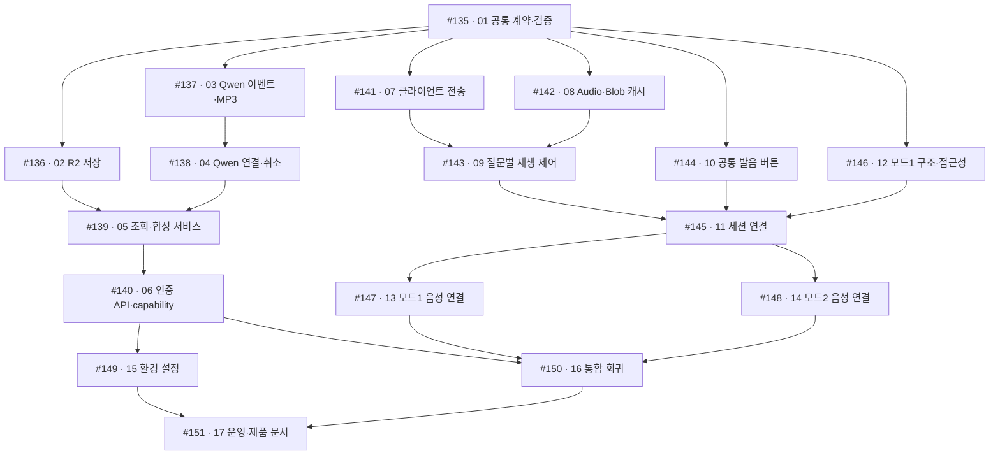

# 중국어 TTS 구현 이슈와 의존성 그래프

> 작성일: 2026-09-14 · 개정일: 2026-09-15 · **17개 재편판** · 베이스: `feat/ch-sound`.
>
> 확정: QwenCloud / `qwen-audio-3.0-tts-flash`, 기본 음색 `longanfengyue`, 속도 1.0. API 키 발급 완료, Worker secret 이름은 `DASHSCOPE_API_KEY`. 실제 시크릿 주입·모델 접근·청취는 미검증이다.
>
> 이전 11개 초안을 이 문서와 TTS-01~17로 대체한다. TTS-01~17은 문서 ID이며 실제 GitHub 번호는 **#135~#151**이다. 17개 이슈와 실행 그래프를 등록했으며 모든 노드는 `pending`이다. 구현은 시작하지 않았다.
>
> 제품 요구사항: [PRD](../PRD-chinese-tts-audio.md). 기술 계약: [아키텍처](../architecture/chinese-tts-audio.md).

## 1. 실행 전 준비와 완료의 의미

한 이슈는 한 모듈 또는 밀접한 연결 경계의 정상·실패 처리와 테스트까지 끝낸다. 정상 동작을 먼저 머지하고 취소·오류 처리를 후속으로 미루는 분할은 하지 않는다. 코드량보다 독립 검증 가능성·수명 관리·공유 파일 충돌을 기준으로 나눴다.

### 실행 전 준비

| 항목 | 필요한 결과 | 현재 상태 |
|---|---|---|
| P0 — 공유 베이스와 문서 | 문서를 후속 worktree에서 읽을 수 있는 커밋으로 공유. 출발점·PR base·머지·후속 갱신에 `feat/ch-sound` 전달 | 문서 커밋 `0ac3ba6` 원격 공유 확인. 자동 실행 시 베이스 전달 확인 필요 |
| P1 — 제공자 결정 | QwenCloud / `qwen-audio-3.0-tts-flash`, 기본 음색·속도·국제 endpoint | 선택 완료 |
| P2 — 실제 환경 | 검증/운영 R2 이름·바인딩·비공개·보관 정책, 환경별 시크릿 주입·접근 상태 | 키 발급 완료. 나머지 미확인 |

P0·P1 뒤에는 실제 키 없이 구현과 자동 검증을 진행할 수 있다. **P2의 실제 버킷 정보는 TTS-15에서 필요하다.** 없으면 TTS-15와 후속 TTS-17의 완료를 미루되 TTS-16의 통합 회귀는 실행할 수 있다. 키 주입·모델 접근·유료 호출·실기기 검증은 별도 출시 확인이며 발급 완료를 접속 성공으로 기록하지 않는다.

현재 `issue-review`·`issue-plan` bootstrap은 원격 기본 브랜치를 사용한다. 탭이 `feat/ch-sound`에 있다는 이유만으로 PR base가 자동 전달되지 않는다. 분기·PR·머지·후속 갱신까지 베이스 전달을 확인해야 하며 `issue-graph` schema에 임의 `meta.base`만 추가해 해결됐다고 간주하지 않는다. 기본 브랜치로 자동 대체하지 않는다.

### 자동 그래프 완료와 출시

TTS-16은 코드 연결과 자동 회귀, TTS-15는 환경 설정, TTS-17은 이를 모은 운영·제품 문서다. **최종 합류는 TTS-17**이며 전체 그래프 완료가 곧 운영 활성화는 아니다. 청취·모바일·실제 R2·지연은 출시 체크리스트에 남기고 운영 flag는 false를 유지한다.

## 2. 등록한 이슈 목록

S는 작은 전송/UI/설정 경계, M은 하나의 상태·저장·연결 경계다. 크기는 일정 약속이 아니다. R2는 실패·경합을 한 저장 모듈 안에서 검증할 수 있어 하나로 유지했다. Qwen·플레이어·세션·모드1은 책임별로 나눴다.

| 문서 ID | 제목 / 이슈 명세 | 직접 선행 이슈 | 크기 | 상태 | GitHub 번호 |
|---|---|---|---|---|---|
| TTS-01 | [중국어 TTS 공통 계약·입력·설정·병음 정책을 정의한다](chinese-tts-audio-issues/TTS-01.md) | 없음 | M | 미착수 | [#135](https://github.com/damdam6/vocabulary-study/issues/135) |
| TTS-02 | [중국어 MP3의 비공개 R2 조회·조건부 저장을 구현한다](chinese-tts-audio-issues/TTS-02.md) | TTS-01 | M | 미착수 | [#136](https://github.com/damdam6/vocabulary-study/issues/136) |
| TTS-03 | [Qwen 이벤트 검증과 MP3 조립을 구현한다](chinese-tts-audio-issues/TTS-03.md) | TTS-01 | M | 미착수 | [#137](https://github.com/damdam6/vocabulary-study/issues/137) |
| TTS-04 | [Qwen WebSocket 합성과 연결 수명을 구현한다](chinese-tts-audio-issues/TTS-04.md) | TTS-03 | M | 미착수 | [#138](https://github.com/damdam6/vocabulary-study/issues/138) |
| TTS-05 | [중국어 음성 조회·합성·저장 서비스를 연결한다](chinese-tts-audio-issues/TTS-05.md) | TTS-02, TTS-04 | M | 미착수 | [#139](https://github.com/damdam6/vocabulary-study/issues/139) |
| TTS-06 | [인증된 중국어 음성 API와 기능 활성 정보를 제공한다](chinese-tts-audio-issues/TTS-06.md) | TTS-05 | M | 미착수 | [#140](https://github.com/damdam6/vocabulary-study/issues/140) |
| TTS-07 | [중국어 음성 API의 클라이언트 전송을 구현한다](chinese-tts-audio-issues/TTS-07.md) | TTS-01 | S | 미착수 | [#141](https://github.com/damdam6/vocabulary-study/issues/141) |
| TTS-08 | [음성 출력과 세션 Blob 캐시의 자원을 관리한다](chinese-tts-audio-issues/TTS-08.md) | TTS-01 | M | 미착수 | [#142](https://github.com/damdam6/vocabulary-study/issues/142) |
| TTS-09 | [질문별 음성 재생과 늦은 응답을 제어한다](chinese-tts-audio-issues/TTS-09.md) | TTS-07, TTS-08 | M | 미착수 | [#143](https://github.com/damdam6/vocabulary-study/issues/143) |
| TTS-10 | [공통 발음 버튼과 재생 상태 표시를 구현한다](chinese-tts-audio-issues/TTS-10.md) | TTS-01 | S | 미착수 | [#144](https://github.com/damdam6/vocabulary-study/issues/144) |
| TTS-11 | [음성 capability와 플레이어를 학습 세션에 연결한다](chinese-tts-audio-issues/TTS-11.md) | TTS-09, TTS-10, TTS-12 | M | 미착수 | [#145](https://github.com/damdam6/vocabulary-study/issues/145) |
| TTS-12 | [모드1 카드 구조와 정답 공개 접근성을 정리한다](chinese-tts-audio-issues/TTS-12.md) | TTS-01 | M | 미착수 | [#146](https://github.com/damdam6/vocabulary-study/issues/146) |
| TTS-13 | [모드1 정답 공개 시 중국어 음성을 연결한다](chinese-tts-audio-issues/TTS-13.md) | TTS-11 | S | 미착수 | [#147](https://github.com/damdam6/vocabulary-study/issues/147) |
| TTS-14 | [모드2 오답 결과에 정답의 중국어 음성을 연결한다](chinese-tts-audio-issues/TTS-14.md) | TTS-11 | M | 미착수 | [#148](https://github.com/damdam6/vocabulary-study/issues/148) |
| TTS-15 | [중국어 TTS의 Worker 환경과 R2 바인딩을 연결한다](chinese-tts-audio-issues/TTS-15.md) | TTS-06 | S | 미착수 | [#149](https://github.com/damdam6/vocabulary-study/issues/149) |
| TTS-16 | [중국어 음성 기능의 대표 통합 흐름과 학습 회귀를 검증한다](chinese-tts-audio-issues/TTS-16.md) | TTS-06, TTS-13, TTS-14 | M | 미착수 | [#150](https://github.com/damdam6/vocabulary-study/issues/150) |
| TTS-17 | [중국어 TTS 운영·출시 절차와 제품 문서를 완성한다](chinese-tts-audio-issues/TTS-17.md) | TTS-15, TTS-16 | S | 미착수 | [#151](https://github.com/damdam6/vocabulary-study/issues/151) |

## 3. 의존성 그래프

모든 의존성은 `issue-graph`의 **AND**다. 아래 ASCII에는 실제 GitHub 번호를 사용한다. 문서 ID와의 대응은 위 목록을 따른다. 등록 순서와 실행 순서는 다르며 TTS-12가 TTS-11보다 먼저 실행되는 것은 모드1 파일 수정 순서를 보장하기 위해서다.

```text
#135 -> #136
#135 -> #137
#137 -> #138
#136, #138 -> #139
#139 -> #140
#135 -> #141
#135 -> #142
#141, #142 -> #143
#135 -> #144
#143, #144, #146 -> #145
#135 -> #146
#145 -> #147
#145 -> #148
#140 -> #149
#140, #147, #148 -> #150
#149, #150 -> #151
```



노드 **17개**, 직접 의존 간선 **23개**, 루트 TTS-01, 최종 합류 TTS-17이다. 루트 뒤 TTS-02·03·07·08·10·12의 6개가 실행 가능하며 실제 동시 실행 수는 오케스트레이터 설정을 따른다. 클라이언트는 공통 계약 fixture로 구현하므로 서버 완료를 기다리지 않는다.

TTS-11은 TTS-12를 기다린 뒤 두 카드의 선택적 prop을 추가하고 TTS-13/14가 각각 음성을 연결한다. **TTS-15와 TTS-16 사이에는 의존성이 없다.** 실제 버킷 준비 때문에 자동 회귀를 지연시키지 않는다.

## 4. 이슈·그래프 등록 기록

- 2026-09-15에 승인된 17개 명세를 GitHub **#135~#151**로 등록했다. 기존 `enhancement` 라벨을 사용했으며 운영·제품 문서 이슈 #151에는 `documentation`을 사용했다.
- 각 이슈 본문의 직접 선행·관련 이슈 참조를 실제 GitHub 번호로 연결했다. 모든 의존성은 선행 이슈 전체의 완료를 기다리는 AND다.
- 메인 체크아웃의 `.git/issue-graph.json`에 **17개 노드·23개 간선**, 루트 **#135**, 최종 합류 **#151**, `max_parallel=5`로 등록했다. 등록 당시 모든 노드는 `pending`이며 구현은 시작하지 않았다.
- 기존 #127·#82의 완료 그래프는 사용자 확인 후 `.git/issue-graph-history/`에 백업했다. landing mode는 **GitHub PR + squash merge**다.
- 오케스트레이터는 workspace `B01A3BBA-4B96-4D8C-81D8-0A1E1FA6D3EC`, terminal surface `1976924D-5F45-463C-A610-C517D7DF207F`다. 이 탭이 `/issue-continue` 완료 콜백을 받는다.
- 시작 시 P0·P1·베이스 전달과 P2 준비 범위를 확인하고 `issue-continue`로 루트부터 진행한다. 출발점·PR base·머지·후속 갱신은 모두 **`feat/ch-sound`**여야 한다. 실행 모델은 시작 시 선택한다.
- 선행 PR 생성만으로 후속을 시작하지 않는다. 같은 베이스로의 머지와 graph의 `done` 상태가 기준이다. 환경 대기나 실패를 완료로 처리하지 않는다.

모든 노드를 실제 이슈로 등록했으므로 실행 도중 label 노드로 새 이슈를 생성하지 않는다. 현재 실행 상태의 기준은 런타임 JSON이며 이 문서는 등록 당시의 기록이다.

## 5. 파일 소유와 병합 경계

| 영역 | 소유와 연결 규칙 |
|---|---|
| 공통 타입·설정·입력·병음 | 01. 후속 이슈가 타입·오류·수치를 재정의하지 않음 |
| R2 저장 | 02. validateAudio를 주입받아 검사하고 MP3 파서를 중복 구현하지 않음 |
| Qwen 순수 프로토콜·공용 MP3 검사 | 03. socket·timer 없는 qwenProtocol.ts/audio.ts |
| Qwen 연결 수명 | 04. 03을 사용하며 signal 전달·socket 정리 담당 |
| 조회·합성·저장 정책 | 05 service.ts. 2/12/2초 예산·경합·백그라운드 작업 등록 담당 |
| HTTP·인증·words·ctx | 06. service 결과 직렬화·ctx.waitUntil 연결 |
| 프론트 전송 / Audio·LRU / controller | 각각 07 / 08 / 09. 포트 주입으로 별도 검증 |
| 공통 버튼 스타일 | 10의 PronunciationButton.css. src/index.css를 수정하지 않음 |
| Home/App/Study·hook·카드 prop | 11. 12 이후 카드 prop만 추가하며 내부 공개 로직은 후속 사용 |
| 모드1 | 12 구조·플립 CSS → 11 선택적 prop → 13 음성 연결 순서 |
| 모드2 | 11 선택적 prop → 14 음성·전용 Mode2Card.css. 공통·모드1 CSS 수정 없음 |
| 환경·생성 Env·환경 기록 | 15. 01 optional TtsEnv를 유지하고 생성 타입만 재생성 |
| 대표 연결 검증·증거 기록 | 16. 상세 실패 조합은 소유 이슈 테스트로 연결 |
| 기존/신규 PRD·운영 절차 | 17. 15/16 기록을 참조하고 다시 작성하지 않음 |

상세 계약 수정이 필요하면 관련 소비자·테스트·아키텍처를 함께 갱신한다. 같은 파일에 서로 다른 책임을 병렬로 덧붙이지 않는다. 기능 이슈의 관련 문서 수정도 자신의 계약 범위에 한정하며 전체 PRD 정리는 17이 소유한다.

## 6. PRD 수용 기준 추적

TTS-16이 아래 전체 AC의 기존 테스트 증거를 모으고 대표 연결 시나리오만 추가 검증한다. 자동 검증과 실제 출시 확인을 구분한다.

| PRD 기준 | 주 구현/검증 이슈 | 최종 증거 / 추가 출시 확인 |
|---|---|---|
| AC-01 | TTS-06, TTS-10, TTS-11, TTS-13, TTS-14 | TTS-16 |
| AC-02 | TTS-12, TTS-13 | TTS-16 |
| AC-03 | TTS-09, TTS-12, TTS-13 | TTS-16 |
| AC-04 | TTS-14 | TTS-16 |
| AC-05 | TTS-01, TTS-10, TTS-13, TTS-14 | TTS-16 |
| AC-06 | TTS-08, TTS-09 | TTS-16 + 모바일 반복 재생 |
| AC-07 | TTS-07, TTS-09 | TTS-16 |
| AC-08 | TTS-04, TTS-05, TTS-07, TTS-09, TTS-11, TTS-13, TTS-14 | TTS-16 + 모바일 전환 |
| AC-09 | TTS-08, TTS-09, TTS-10 | TTS-16 + 모바일 자동재생 |
| AC-10 | TTS-03, TTS-04, TTS-05, TTS-06, TTS-07, TTS-09, TTS-10, TTS-11 | TTS-16 |
| AC-11 | TTS-01, TTS-10, TTS-12, TTS-13, TTS-14 | TTS-16 + 실제 화면·200% 확대 |
| AC-12 | TTS-01, TTS-02, TTS-03, TTS-05, TTS-06 | TTS-16 + 다음자 제한 확인·청취 |
| AC-13 | TTS-02, TTS-05 | TTS-16 |
| AC-14 | TTS-01, TTS-06 | TTS-16 |
| AC-15 | TTS-10, TTS-12, TTS-13, TTS-14 | TTS-16 + 키보드·모션·모바일 |
| AC-16 | TTS-09, TTS-11 | TTS-16 |
| AC-17 | TTS-11, TTS-12, TTS-13, TTS-14, TTS-16 | TTS-16 |
| AC-18 | TTS-06, TTS-11, TTS-15 | TTS-16 |
| AC-19 | TTS-02, TTS-03, TTS-04, TTS-05, TTS-06 | TTS-16 + 실제 R2 재사용 |
| AC-20 | TTS-02, TTS-05, TTS-06 | TTS-16 + 실제 장애/접근 |
| AC-21 | TTS-02, TTS-05, TTS-06 | TTS-16 + 실제 저장 관측 |
| AC-22 | TTS-02, TTS-05 | TTS-16 + 실제 R2 경합 |
| AC-23 | TTS-02, TTS-05, TTS-15, TTS-17 | TTS-16 + 환경·설정 변경 |
| AC-24 | TTS-02, TTS-06, TTS-15, TTS-17 | TTS-16 + 비공개·프로필 격리 |

## 7. 후속 백로그

지원 음색 확인 후 병음 강제 지정·음절 분해기, 등록 직후 선생성·전체 배치, 문장 등록/채점 확장, 다국어, 파일 자동 정리·전역 중복 합성 방지는 별도 이슈로 다룬다.

## 8. 이전 초안과의 대응

아래 왼쪽은 **폐기된 11개 초안의 임시 번호**다. 새 번호와 의미가 다르므로 등록에는 위 17개 목록을 사용한다.

| 이전 초안 | 새 이슈 | 조정 |
|---|---|---|
| 이전 01 + 02 | TTS-01 | 공통 계약과 단순 병음 정책 통합 |
| 이전 03 | TTS-02 | R2 한 모듈 유지 |
| 이전 04 | TTS-03, TTS-04 | 순수 이벤트·오디오 / 연결 수명 |
| 이전 05 | TTS-05, TTS-06 | 서비스 / HTTP 경계 |
| 이전 06 | TTS-07, TTS-08, TTS-09 | 전송 / 자원 / 질문 제어 |
| 이전 07 | TTS-10, TTS-11 | 버튼 / 세션 연결 |
| 이전 08 | TTS-12, TTS-13 | 카드 구조 / 음성 연결 |
| 이전 09 | TTS-14 | 모드2 연결 유지 |
| 이전 10 | TTS-15, TTS-17 | 환경 / 운영·제품 문서 |
| 이전 11 | TTS-16 | 대표 통합 회귀로 범위 한정 |
